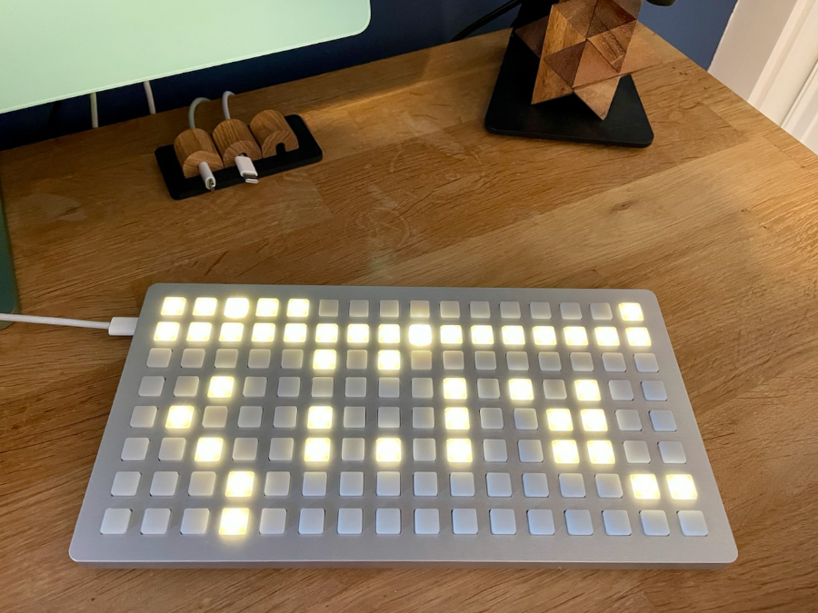

# Flurries

Flurries is a cycling/fluid midi sequencer for monome grids running iii.

## How to install

Designed to run on a monome grid with [iii firmware](https://monome.org/docs/iii/) installed.

Connect your monome grid using the [diii](https://monome.org/diii/) browser utility, and upload flurries.lua. In the left-hand menu locate flurries.lua, and select **'first'** from the **'...'** menu. See [dii documentation](https://monome.org/docs/iii/diii/) for more guidance on uploading and managing ii scripts.

## In use

The 16-step sequencer allows mid-sequence on-the-fly direction and loop length changes, by holding two buttons on the second grid row. Loop changes become active on button release. Five stages of clock dividers/multipliers can be cycled through using the five top left buttons. Pressing the currently active divider pauses the sequencer.

Each sequencer step can hold up to 4 sub-steps. Add sub-steps by pressing buttons in rows 3 to 8, each row representing 1 of 6 available midi note values. The order of button presses determines the order of sub-steps within a step. Adding more than 4 sub-steps cycles out the oldest in that step.

Holding the top right menu button provides an overview of populated steps, and lets you clear steps using the bottom grid row.

Flurries has its own internal clock, but can also sync to incoming midi clock.

Various adjustable parameters are exposed at the top of the script (default tempo, midi out channel, midi notes available, number of sub-steps allowed, etc)

Flurries was built and tested using a monome 128 grid (late 2022 edition). It may also run on a 256 grid, but has not been optimised for the additional 8 rows and is currently untested.

I may add further features in the future.

## Acknowledgements

Credit to [monome](https://monome.org/) for creating the monome grid, and all their work on implementing the iii lua scripting environment.
Particular thanks to tehn for writing [meadowphysics](https://monome.org/docs/iii/library/mp/) - it's really simple but effective handling for timing midi note on/off messages saved me from wasting countless hours on nested metros.

I learned a huge amount about writing lua through reading monome iii and norns scripts generously shared on [lines](https://llllllll.co/).
